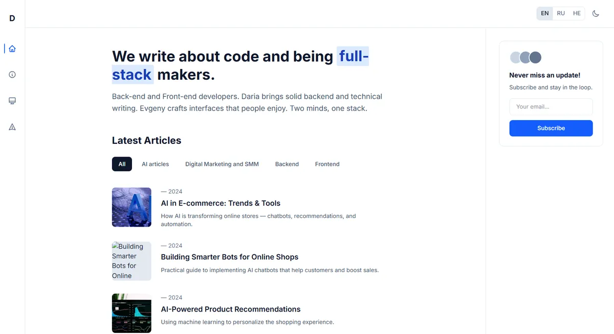
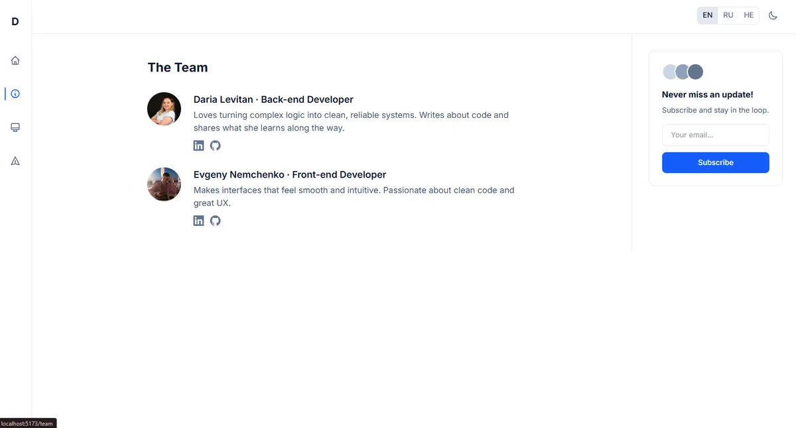

# AI Space: developer duo blog and portfolio

A trilingual (English / Russian / Hebrew with right-to-left layout) blog and portfolio site for a two-person developer team, Daria Levitan (back end) and Evgeny Levitan (front end). It lists articles by category (AI, digital marketing and SMM, back end, front end), introduces the team and showcases projects. Built as a small, typed Vue 3 single-page app with lazy-loaded routes, a dark mode and a language switcher that also flips the page direction.

<p align="center">
  
</p>
<p align="center">
  
</p>

**Stack:** Vue 3 (Composition API, `<script setup>`) · TypeScript · Vue Router (lazy-loaded views) · Tailwind CSS 4 · Vite 7. Translations, articles, categories, team and projects live in typed modules under `website/src/i18n` and `website/src/data`, and the chosen language and theme are remembered in `localStorage`.

## Run locally

```bash
cd website
npm install
npm run dev        # http://localhost:5173
npm run build && npm run preview
```

## Author

Evgeny Levitan, full-stack developer: [bluecat.cc](https://bluecat.cc) · [LinkedIn](https://www.linkedin.com/in/evgeny-nemchenko) · [nevgeny90@gmail.com](mailto:nevgeny90@gmail.com) · [GitHub @Jony251](https://github.com/Jony251)
